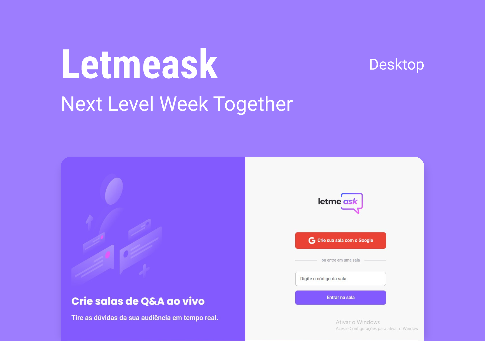

<p align="center">
  
</p>

<p align="center">
  

  

  <a href="https://github.com/Andresa-Alves-Ribeiro/letmeask/commits/main">
    
  </a>

  

  

  
</p>

<h1 align="center">
    
</h1>

<br>

## Deploy

[Firebase](https://letmeask-4e263.web.app/)

---

## 🧪 Technologies

This project was developed using the following technologies:

-   [React](https://reactjs.org)
-   [Firebase](https://firebase.google.com/)
-   [Sass](https://sass-lang.com/)
-   [TypeScript](https://www.typescriptlang.org/)
-   [Styled-Components](https://styled-components.com/)

## 🚀 Getting started

Clone the project and access the folder.

```bash
$ git clone https://github.com/Andresa-Alves-Ribeiro/letmeask
$ cd letmeask
```

Follow the steps below:

```bash
# Install the dependencies
$ npm

# Start the project
$ npm run start
```

The app will be available for access on your browser at http://localhost:3000

## 🔖 Layout

You can view the project layout through the links below:

-   [Layout Web](https://www.figma.com/file/u0BQK8rCf2KgzcukdRRCWh/Letmeask/duplicate)

Remembering that you need to have a [Figma](http://figma.com/) account to access it.
<br>

<p align="center">Made with 💜 by Andresa Alves Ribeiro 🔥</p>
